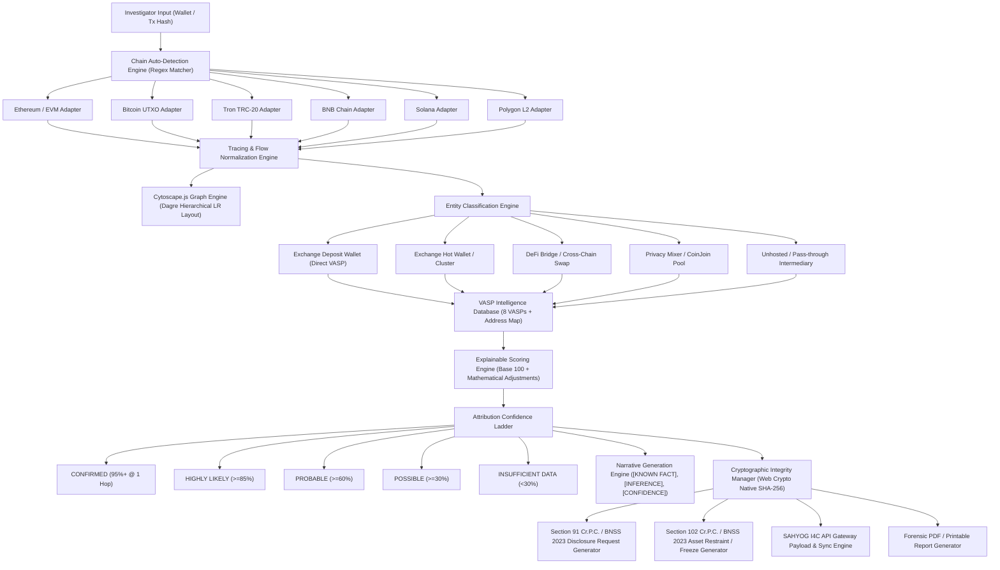

# 🛡️ CHAIN-INTEL — Master Executive Summary & Complete System Architecture

---

## 🏛️ Executive Summary & Mission Overview

**CHAIN-INTEL** is a browser-based, investigator-facing **Blockchain Forensic Intelligence Workstation** engineered for Indian Law Enforcement Agencies (LEAs), cybercrime investigators, and national security analysts. Built under **Smart India Hackathon 2026 (Problem Statement 26182)** for the **Ministry of Home Affairs (MHA) — Indian Cyber Crime Coordination Centre (I4C) / CIS Division**, the workstation automates the identification and forensic tracing of unhosted cryptocurrency wallet addresses and multi-hop transaction flows to isolate the **Nearest Direct-Deposit Accepting Virtual Asset Service Provider (VASP)**.

### 📌 Problem Context & Solved Challenge
In cybercrime investigations (e.g., Telegram investment scams, healthcare ransomware extortion, darknet narcotics proceeds, cross-chain DeFi exploits), criminals route illicit cryptocurrency through multiple unhosted wallets, peel chains, cross-chain bridges, and mixing protocols. Manual analysis of thousands of raw blockchain transactions across disparate explorers is time-prohibitive. 

**CHAIN-INTEL** solves this challenge by:
1. **Auto-detecting blockchain networks and address types** across 6 major blockchains (Bitcoin, Ethereum, Tron, BNB Chain, Solana, Polygon).
2. **Performing multi-hop graph trace analysis** using Cytoscape.js with hierarchical Dagre layout rendering.
3. **Classifying on-chain entities** (Exchange Deposit Wallets, Exchange Hot Wallets, Exchange Clusters, DeFi Bridges, Privacy Mixers/Tumblers, Unhosted Wallets).
4. **Isolating the Nearest Direct-Deposit Accepting VASP** rather than just a distant hot wallet, providing actionability for exchange disclosures.
5. **Computing an explainable attribution confidence score** mapped to a 5-tier confidence ladder (`CONFIRMED`, `HIGHLY_LIKELY`, `PROBABLE`, `POSSIBLE`, `INSUFFICIENT_DATA`).
6. **Generating automated plain-language forensic narratives** with explicit epistemic demarcations (`[KNOWN FACT]`, `[INFERENCE]`, `[CONFIDENCE & EVALUATION]`, `[SYSTEM LIMITATION]`).
7. **Generating court-ready legal drafts** under **Section 91 Cr.P.C. / BNSS 2023** (Disclosure Request) and **Section 102 Cr.P.C. / BNSS 2023** (Asset Freeze Order).
8. **Stamping reports with deterministic SHA-256 chain-of-custody hashes** verified against an append-only audit ledger.
9. **Integrating with SAHYOG** (MHA I4C Inter-Agency API) via structured JSON payloads and mock REST endpoints.

---

## 🏛️ SIH 2026 Problem Statement Alignment

| Attribute | Specification |
| :--- | :--- |
| **Problem Statement ID** | **26182** |
| **Organization** | **Ministry of Home Affairs (MHA) — Indian Cyber Crime Coordination Centre (I4C) / CIS Division** |
| **Theme** | **Blockchain & Cybersecurity** |
| **Category** | **Software** |
| **Target Audience** | Cyber Crime Investigation Cells, Police Departments, FIU-IND, CERT-In, Enforcement Directorate |
| **Core Deliverable** | Automated multi-chain unhosted wallet tracer, nearest direct-deposit VASP attribution engine, risk typology detector, cryptographic chain-of-custody generator, and legal workflow workstation |

---

## 🏗️ System Architecture & Workflow Diagram



---

## 💻 Comprehensive Technology Stack

| Layer | Component | Version / Specification | Technical Role |
| :--- | :--- | :--- | :--- |
| **Frontend Core** | React | `^19.2.8` | Declarative component UI engine |
| **Build & Tooling** | Vite | `^8.2.2` | Fast HMR dev server and production bundler |
| **Language** | TypeScript | `~6.0.2` (Strict Mode) | Static type safety and domain model contracts |
| **Styling & Design** | Tailwind CSS + Custom CSS | `@tailwindcss/vite ^4.3.3` | Custom CSS tokens (`App.css`, `index.css`) for Light-First Government Workstation aesthetic |
| **Graph Engine** | Cytoscape.js | `^3.34.3` | High-performance canvas node-edge graph visualization |
| **Graph Layout** | cytoscape-dagre | `^4.0.1` | Directed acyclic graph hierarchical left-to-right (LR) positioning |
| **Iconography** | Lucide React | `^1.42.0` | Clean vector iconography |
| **Cryptographic Hashing** | Web Crypto API | `crypto.subtle.digest` | Native client-side deterministic SHA-256 hashing (no external npm library) |
| **Linting & Quality** | oxlint | `^1.79.0` | Ultra-fast JS/TS static code analysis |

---

## 🧠 Engine Layer Deep Dive (`src/engine/`)

The workstation's core logic is decoupled into 7 specialized engine modules:

### 1. Chain Adapter Engine (`src/engine/adapters/chainAdapter.ts`)
- **`detectChainAndType(input: string)`**: Uses high-performance regular expressions to automatically identify the blockchain network and input type (`WALLET` vs `TX_HASH`) without requiring manual investigator configuration:
  - `Tron`: Starts with `T`, Base58 string of 34 characters (`/^T[a-zA-HJ-NP-Z0-9]{33}$/`).
  - `Ethereum Wallet`: Starts with `0x`, 40 hexadecimal characters (`/^0x[a-fA-F0-9]{40}$/`).
  - `EVM Tx Hash`: Starts with `0x`, 64 hexadecimal characters (`/^0x[a-fA-F0-9]{64}$/`).
  - `Bitcoin Wallet`: Starts with `bc1` (Bech32) or `1` or `3` (Legacy/P2SH), 25 to 62 characters (`/^(bc1|[13])[a-zA-HJ-NP-Za-km-z0-9]{25,62}$/`).
  - `Solana Wallet`: Base58 string of 32 to 44 characters (`/^[1-9A-HJ-NP-Za-km-z]{32,44}$/`).
- **Adapter Classes**: Implements the `ChainAdapter` interface (`validateAddress`, `validateTxHash`, `fetchTrace`) for `EthereumAdapter`, `BitcoinAdapter`, `TronAdapter`, `BNBAdapter`, `SolanaAdapter`, and `PolygonAdapter`.

### 2. VASP Intelligence Database (`src/engine/vasp/vaspDatabase.ts`)
- **`KNOWN_VASP_DATABASE`**: Authoritative directory of verified VASP entities:
  - **CoinDCX**: Domestic Indian Exchange, FIU-IND Registered, Nodal Officer contact: `nodal-officer@coindcx.com`.
  - **Binance**: Global Exchange, FIU-IND Registered, Cooperation Priority: `CROSS_BORDER_PRIORITY`, Compliance: `le-compliance@binance.com`.
  - **WazirX**: Domestic Indian Exchange, FIU-IND Registered, Compliance: `legal@wazirx.com`.
  - **Kraken**: US Exchange, FinCEN Registered, Compliance: `lawenforcement@kraken.com`.
  - **FixedFloat**: Seychelles Non-KYC Instant Swap Service, Priority: `URGENT_REVIEW`.
  - **Tornado Cash Protocol**: OFAC Sanctioned Decentralized Smart Contract Privacy Mixer.
  - **Wasabi Wallet CoinJoin Pool**: Decentralized Bitcoin Privacy Protocol.
  - **Synapse Cross-Chain Bridge**: Decentralized Liquidity Protocol for L1/L2 bridging.
- **`KNOWN_ADDRESS_MAP`**: Seeded address dictionary mapping public wallet addresses (e.g., `0x71c7656ec7ab88b098defb751b7401b5f6d8976f`, `0x3f5ce5fbfe3e9af3971dd833d26ba9b5c936f0be`, `bc1qgdjqv0av3q56jvd822y7tfwx8d97tfchae5002`) to VASP entities.
- **`matchAddress(address: string)`**: Multi-stage matching algorithm:
  1. Exact lookup in `KNOWN_ADDRESS_MAP`.
  2. Direct string substring/suffix heuristics (e.g., CoinDCX deposit suffix checks).
  3. Returns a structured `MatchResult` containing `isMatch`, `matchType` (`EXACT_MATCH`, `KNOWN_DEPOSIT`, `CLUSTER_RELATION`, `FORWARDING_RELATION`, `NO_MATCH`), confidence score, and human-readable explanation.

### 3. Explainable Attribution Scoring Engine (`src/engine/scoring/scoringEngine.ts`)
Implements an explainable mathematical scoring engine. Starts at a **Base Score of 100** and applies structured mathematical factor adjustments:

$$\text{Final Score} = \text{Clamp}_{0}^{100}\left( 100 + \sum \text{Factor Impacts} \right)$$

#### Factor Adjustments Matrix:
| Factor Category | Condition / Trigger | Score Adjustment |
| :--- | :--- | :---: |
| **No VASP Match** | Address does not match any known VASP | Immediately returns 15% (`INSUFFICIENT_DATA`) |
| **Direct VASP Match** | Nearest Direct-Deposit VASP identified | +5 to +10 bonus |
| **Direct 1-Hop Deposit** | Funds deposited in 1 hop without obfuscation | +8 bonus |
| **Hop Penalty** | Hop distance $H > 1$ | $\min((H - 1) \times 3, 15)$ penalty |
| **Flow Continuity** | $>90\%$ value preserved through path | +4 bonus |
| **Balance Fragmentation**| $<60\%$ value preserved (heavy splitting) | -12 penalty |
| **Intelligence Quality** | Recent VASP address dataset verification | +3 bonus |
| **Privacy Mixer** | Path passes through Tornado Cash / Wasabi CoinJoin | -35 penalty |
| **Chain Hopping** | Path crosses a multi-chain bridge (e.g., Synapse) | -15 penalty |
| **Peel Chain** | Systematic minor fee deduction observed | -6 penalty |

#### 5-Tier Confidence Ladder Mapping:
- **`CONFIRMED`**: Final Score $\ge 95\%$ AND Hop Distance $= 1$.
- **`HIGHLY_LIKELY`**: Final Score $\ge 85\%$.
- **`PROBABLE`**: Final Score $\ge 60\%$.
- **`POSSIBLE`**: Final Score $\ge 30\%$.
- **`INSUFFICIENT_DATA`**: Final Score $< 30\%$.

### 4. Forensic Narrative Generator (`src/engine/narrative/narrativeEngine.ts`)
- **`generateInvestigatorNarrative(caseData)`**: Automatically synthesizes a 4-paragraph plain-English summary adhering to strict forensic reporting standards. Each paragraph starts with a mandatory epistemic tag:
  - `[KNOWN FACT]`: Verifiable blockchain records (target input, chain, exact analyzed transaction count).
  - `[INFERENCE]`: Deductive reasoning on intermediary wallet behavior, peel-chain patterns, and detected money-laundering typologies.
  - `[CONFIDENCE & EVALUATION]`: Final attribution summary isolating the nearest direct-deposit accepting VASP, confidence tier, and percentage score.
  - `[SYSTEM LIMITATION & NOTE]`: Explicit disclaimer stating that the workstation provides investigative leads requiring independent legal verification prior to judicial submission.

### 5. Legal Notice Generator (`src/engine/legal/legalNoticeEngine.ts`)
- **`generateLegalNoticeDraft(caseData)`**: Generates a formal legal disclosure notice draft under **Section 91 Cr.P.C. / BNSS 2023** addressed to the VASP Nodal Officer. Demands subscriber KYC/AML records, bank withdrawal logs, and registered IP logs within 24 hours. Includes case reference, investigator details, deposit address, confidence score, and SHA-256 hash stamp.
- **`generateFreezeRequestDraft(caseData)`**: Generates an urgent asset restraint order under **Section 102 Cr.P.C. / BNSS 2023** directing the VASP compliance team to place an administrative freeze on the deposit account to prevent fiat or P2P diversion within 4 hours.

### 6. Cryptographic Integrity Manager (`src/engine/integrity/integrityManager.ts`)
- **`computeSHA256(text: string)`**: Executes native `crypto.subtle.digest('SHA-256', ...)` to compute 64-character hexadecimal digests.
- **`generateReportHash(caseData)`**: Serializes core case attributes (ID, case reference, target input, chain, destination VASP, confidence score, date, hop count) into JSON, computes its SHA-256 digest, and appends a record to an in-memory append-only audit ledger (`AUDIT_LEDGER`).
- **`verifyReportHash(hashToVerify: string)`**: Verifies any report hash against the internal audit ledger or validates 64-character hex strings for historical authenticity.

### 7. SAHYOG Inter-Agency Service (`src/engine/sahyog/sahyogService.ts`)
- **`createSahyogPayload(caseData)`**: Formats an active investigation into a standardized `SahyogPayload` object for inter-agency routing with MHA I4C.
- **`MOCK_SAHYOG_ENDPOINTS`**: Documents 3 REST API endpoints with request/response schemas:
  - `POST /api/v1/sahyog/investigations`: Case creation endpoint.
  - `GET /api/v1/sahyog/traces/:id`: Real-time trace retrieval.
  - `POST /api/v1/sahyog/disclosure-notice`: Automated legal notice dispatch.

---

## 🎨 Interactive Visualizer & UI Component Architecture

The workstation UI is organized into structured, modular React components:

```
src/
├── components/
│   ├── layout/
│   │   ├── Sidebar.tsx            # Persistent 11-tab sidebar navigation with alert counter
│   │   └── TopNav.tsx             # Workstation search bar, active case status badge, LIVE/DEMO mode toggle
│   ├── dashboard/
│   │   └── DashboardScreen.tsx    # Executive metrics grid, quick-launch case cards, active investigation queue
│   ├── investigation/
│   │   └── NewInvestigationScreen.tsx # Form for launching wallet/tx hash traces with auto-detection
│   ├── trace/
│   │   ├── TraceAnalysisScreen.tsx    # Master trace workstation container (Overview, Evidence, Timeline)
│   │   ├── CytoscapeGraph.tsx         # Cytoscape.js graph canvas with dagre LR layout & interactive legend
│   │   ├── HopPlaybackPlayer.tsx      # Step-by-step transaction sequence player with speed controls (1x, 2x, 4x)
│   │   ├── ConfidenceLadderCard.tsx   # Attribution card with 5-tier spectrum bar & factor breakdown
│   │   ├── InvestigatorStoryCard.tsx  # Plain-English forensic narrative container with epistemic tags
│   │   ├── RightNodeDrawer.tsx        # Slide-over panel for selected node metadata & block explorer links
│   │   ├── EvidenceExplorerTab.tsx    # Table of evidence items with strength ratings (STRONG/MODERATE/WEAK)
│   │   └── CaseTimelineTab.tsx        # Chronological log of transaction events with risk badges
│   ├── alerts/
│   │   └── HighRiskAlertsScreen.tsx   # Alert triage center with one-click legal notice trigger
│   ├── vasp/
│   │   └── VASPIntelligenceScreen.tsx # Directory of 8 known VASPs with jurisdiction filters & contacts
│   ├── batch/
│   │   └── BatchInvestigationScreen.tsx # Bulk CSV trace processor with simulated progress loader
│   ├── reports/
│   │   └── ReportsScreen.tsx          # Printable A4 forensic report, PDF export, & SHA-256 verification tool
│   ├── sahyog/
│   │   ├── SahyogIntegrationScreen.tsx# MHA I4C API Gateway simulator & JSON payload inspector
│   │   ├── LegalNoticeModal.tsx       # Section 91 Cr.P.C. disclosure notice draft modal
│   │   └── FreezeRequestModal.tsx     # Section 102 Cr.P.C. account freeze order draft modal
│   ├── commons/
│   │   └── VASPCommonsScreen.tsx      # Shared national VASP address verification layer
│   ├── history/
│   │   └── CaseHistoryScreen.tsx      # Historical investigation archive with search & chain filters
│   └── status/
│       └── SystemStatusScreen.tsx     # Health indicators & real-time audit log stream viewer
```

---

## 📺 Complete Workstation Screen Catalog (11 Screens)

### 1. 📊 Executive Dashboard (`DashboardScreen`)
- **Metric Cards**: Active Cases (4), High-Risk Targets (2), Recent Traces (12), Pending Review (1), VASP Matches (8), Reports Issued (14).
- **Quick-Launch Carousel**: 3 prominent cards for instant loading of top demonstration cases (`TB-001`, `TB-002`, `TB-003`).
- **Investigation Queue Table**: Searchable queue displaying Case ID, Target Address, Chain, Priority, Status, Attributed VASP, Confidence Tier, and Action Buttons.

### 2. 🔍 New Investigation (`NewInvestigationScreen`)
- **Input Form**: Case Reference (auto-generated), Investigator Name, Target Address/Tx Hash, Blockchain Network Selector, Incident Category, Priority Selector, and Notes.
- **Live Auto-Detection Badge**: Real-time Regex feedback confirming chain validity (`Ethereum`, `Bitcoin`, `Tron`, `BNB`, `Solana`, `Polygon`).
- **Trace Parameters**: Max Hop Depth slider (1 to 6 hops) and Minimum Transfer Value threshold.
- **SIH Judge Preset Selector**: Dropdown to load any of the 6 official demonstration scenarios with 1 click.

### 3. 🕸️ Trace Analysis Workstation (`TraceAnalysisScreen`) — Primary Screen
Divided into 3 sub-tabs:
- **OVERVIEW Tab**:
  - **`HopPlaybackPlayer`**: Interactive step-by-step transaction playback engine. Includes Play/Pause controls, Reset, Step Forward/Backward, and Speed Toggle (`1x`, `2x`, `4x`). Auto-animates graph edges and highlights active hop data (amount, USD value, timestamp, typology, VASP deposit match).
  - **`CytoscapeGraph`**: Cytoscape.js canvas running Dagre hierarchical Left-to-Right layout. Styled node categories:
    - `Suspect Target`: Blue circle with thick border.
    - `Exchange Deposit Wallet`: Blue rectangle with emerald border.
    - `Exchange Hot Wallet / Cluster`: Dark blue rectangle.
    - `DeFi Bridge / Swap`: Amber rounded rectangle.
    - `Mixer / Tumbler`: Red diamond.
  - **`RightNodeDrawer`**: Slide-over metadata inspector displaying address, node role, chain, transaction count, total volume, last active date, VASP match banner, copy address button, and external Block Explorer link (Etherscan/Btcscan).
  - **`ConfidenceLadderCard`**: Isolates the **Nearest Direct-Deposit Accepting VASP**, displays the 5-tier spectrum bar, candidate rankings, compliance officer email, and collapsible mathematical factor breakdown (+/- adjustments).
  - **`InvestigatorStoryCard`**: Renders the 4-paragraph forensic narrative formatted with color-coded epistemic tags.
- **EVIDENCE Tab (`EvidenceExplorerTab`)**: Tabular list of investigative evidence, source datasets, verification dates, and strength badges (`STRONG`, `MODERATE`, `WEAK`).
- **TIMELINE Tab (`CaseTimelineTab`)**: Chronological ledger of all hop events, timestamps, values, hashes, and risk indicators.

### 4. 🚨 High-Risk Intelligence Alerts (`HighRiskAlertsScreen`)
- Consolidated triage table of critical risk events (`RANSOMWARE`, `DARKNET_MARKET`, `TERRORISM_FINANCING`, `SANCTIONED_MIXER`, `FRAUD_SCAM`).
- Action controls to immediately open Section 102 Account Freeze orders or jump into the Trace Analysis workstation.

### 5. 🏛️ VASP Intelligence Repository (`VASPIntelligenceScreen`)
- Directory cards for 8 pre-seeded VASPs (`CoinDCX`, `Binance`, `WazirX`, `Kraken`, `FixedFloat`, `Tornado Cash`, `Wasabi`, `Synapse Bridge`).
- Filters by FIU-IND domestic registration status, international jurisdiction, and risk category. Shows cluster size, verification date, and official compliance email contacts.

### 6. ⚡ Batch Investigation Processor (`BatchInvestigationScreen`)
- High-throughput processing interface for bulk investigations.
- Simulated CSV file uploader with animated progress bar (0% to 100% over 1.6s), populating batch case records with auto-calculated attribution results.

### 7. 📄 Legal Reports & Verification (`ReportsScreen`)
- **Cryptographic Hash Verification Tool**: Input box to paste any SHA-256 hash string and verify its authenticity against the append-only audit ledger.
- **Printable A4 Forensic Report**: Clean document card featuring MHA I4C header, case summary, plain-language narrative, hop transaction log table, legal disclaimer, and deterministic SHA-256 chain-of-custody stamp with "Integrity Validated" seal.
- **Action Buttons**: `Print / Save PDF Report` (`window.print()`) and `Draft Legal Disclosure Request`.

### 8. 🌐 SAHYOG API Gateway (`SahyogIntegrationScreen`)
- Interactive interface demonstrating REST API interoperability with the MHA I4C SAHYOG portal.
- Includes endpoint documentation, sample JSON request/response payloads, and a `Test Sync Active Case` trigger simulating an 800ms API round-trip.

### 9. 🤝 VASP Intelligence Commons (`VASPCommonsScreen`)
- Shared national address verification repository allowing law enforcement officers to view, confirm, or flag crowd-sourced address labels across agencies.

### 10. 📜 Case History Archive (`CaseHistoryScreen`)
- Searchable historical case ledger supporting query filtering by Case Reference, Target Address, Blockchain Network, or Attributed VASP.

### 11. 🛡️ System Status & Audit Stream (`SystemStatusScreen`)
- Operational indicators for Blockchain Adapters, VASP Intelligence Database, Cytoscape Layout Engine, and SHA-256 Audit Logger.
- Live streaming view of the immutable `AUDIT_LEDGER` table recording all system actions, timestamps, user IDs, and generated report hashes.

---

## 🎯 Pre-Loaded SIH 2026 Demonstration Scenarios

The workstation includes 6 fully-articulated test cases ready for live judge evaluation:

| Case ID | Crime Category | Chain | Target Input Address / Hash | Nearest Direct-Deposit VASP | Attribution Tier | Score | Detected Typologies |
| :---: | :--- | :---: | :--- | :--- | :---: | :---: | :--- |
| **TB-001** | Telegram Investment Fraud | Ethereum | `0x71C7656EC7ab88b098defb751b7401b5f6d8976f` | **CoinDCX India** (FIU-IND) | `HIGHLY_LIKELY` | **91%** | Peel-Chain Forwarding, Structured Layering |
| **TB-002** | Healthcare Ransomware Extortion | Ethereum | `0x3f5ce5fbfe3e9af3971dd833d26ba9b5c936f0be` | **Binance** (Global FIU) | `HIGHLY_LIKELY` | **87%** | Ransomware Outflow (BlackCat), Direct Sweep |
| **TB-003** | Darknet Narcotics Proceeds | Bitcoin | `bc1qxy2kgdygjrsqtzq2n0yrf2493p83kkfjhx0wlh` | **WazirX India** (FIU-IND) | `PROBABLE` | **78%** | Wasabi CoinJoin Mixer, Darknet Vendor Cluster |
| **TB-004** | Terrorism Financing Risk | Tron | `T9yD1428fk820fk820fk820fk820fk820fk8` | **Binance** (Tron USDT) | `HIGHLY_LIKELY` | **84%** | High-Frequency TRC-20 USDT Outflow, Watchlist Match |
| **TB-005** | Cross-Chain DeFi Exploit | Ethereum | `0x0d0707963952f2a77298587ab17fa5b169528d9c` | **FixedFloat** (Seychelles) | `PROBABLE` | **64%** | Synapse Bridge Transition, Polygon L2 Mint |
| **TB-006** | Sanctioned Mixer Wash | Ethereum | `0x12d66f87a04a9e220743712ce6d9bb1b5616b8fc` | **None** (Tornado Cash) | `INSUFFICIENT_DATA` | **24%** | Sanctioned Smart Contract (Tornado Cash 100 ETH) |

---

## ⚖️ Indian Law Enforcement Legal Workflows

**CHAIN-INTEL** bridges digital forensics and statutory criminal procedure under Indian law:

### 1. Section 91 Cr.P.C. / BNSS 2023 (Disclosure Notice)
- **Statutory Purpose**: Empowering Investigating Officers to compel production of documents or electronic records.
- **Automated Workflow**: When a VASP deposit is identified, the workstation auto-populates a formal legal notice addressed to the exchange Nodal Officer. It demands subscriber KYC/AML records, bank transaction receipts, and IP connection logs within 24 hours.

### 2. Section 102 Cr.P.C. / BNSS 2023 (Asset Restraint Order)
- **Statutory Purpose**: Empowering police officers to seize or freeze property suspected to be stolen or linked to crime proceeds.
- **Automated Workflow**: For high-risk or ransomware incidents, the workstation drafts an urgent restraint request directing the VASP to freeze the recipient exchange account, halt fiat bank transfers, and confirm compliance within 4 hours.

### 3. SAHYOG I4C Integration
- Provides direct payload mapping for the Indian Cyber Crime Coordination Centre (I4C) national cybercrime reporting portal, allowing automated sync of investigation leads across state police jurisdictions.

---

## 🎨 Design Philosophy & UX Principles

CHAIN-INTEL follows strict **Government Workstation Visual Guidelines**:
- **Light-First Palette**: Off-white background (`#F8FAFC`), crisp white containers (`#FFFFFF`), subtle slate borders (`#E2E8F0`), deep navy typography (`#0F172A`), and clean sans-serif typography (Inter).
- **Restrained Semantic Colors**: Green for verified/safe, Amber for caution/typology, Rose for critical risk/freeze orders, Blue for primary actions.
- **Strictly No Cyberpunk Tropes**: Completely avoids dark hacker backgrounds, glowing neon cards, or Web3 crypto-bro aesthetics to ensure absolute professional credibility before government technology evaluators.

---

## 📁 Workspace Sitemap & File Directory

```
SIH 2026 project/
├── .gitignore
├── .oxlintrc.json
├── EXPLANATION.md               # Master System Explanation Document (This File)
├── README.md                    # Project README & SIH 2026 Overview
├── index.html                   # HTML5 Entry Point
├── package.json                 # Node.js Dependencies & NPM Scripts
├── tsconfig.json                # TypeScript Root Configuration
├── tsconfig.app.json            # Application TS Config
├── tsconfig.node.json           # Node Environment TS Config
├── vite.config.ts               # Vite & Tailwind CSS Plugin Setup
└── src/
    ├── App.css                  # Custom Layout & Scrollbar Token Styling
    ├── App.tsx                  # Master Application Router, State Manager, & Modal Host
    ├── index.css                # Tailwind CSS v4 Directives & Base Utility Classes
    ├── main.tsx                 # React DOM Root Renderer
    ├── types/
    ├── index.ts             # Complete TypeScript Domain Type System (26 Exported Types)
    ├── engine/
    │   ├── adapters/
    │   │   └── chainAdapter.ts  # Chain Detection Regex & Adapter Implementations
    │   ├── integrity/
    │   │   └── integrityManager.ts # SHA-256 Hashing & Audit Ledger Manager
    │   ├── legal/
    │   │   └── legalNoticeEngine.ts # Section 91 & Section 102 Legal Text Generators
    │   ├── narrative/
    │   │   └── narrativeEngine.ts # 4-Paragraph Epistemic Forensic Narrative Generator
    │   ├── sahyog/
    │   │   └── sahyogService.ts # SAHYOG Payload Formatter & Mock Endpoint Definitions
    │   ├── scoring/
    │   │   └── scoringEngine.ts # 100-Point Mathematical Attribution Engine & Ladder Mapping
    │   └── vasp/
    │       └── vaspDatabase.ts  # Directory of 8 VASPs, Known Address Map, & Matcher
    ├── demo/
    │   └── demoCases.ts         # Pre-Populated Dataset for 6 SIH Demonstration Cases
    └── components/
        ├── layout/ (Sidebar, TopNav)
        ├── dashboard/ (DashboardScreen)
        ├── investigation/ (NewInvestigationScreen)
        ├── trace/ (TraceAnalysisScreen, CytoscapeGraph, HopPlaybackPlayer, etc.)
        ├── alerts/ (HighRiskAlertsScreen)
        ├── vasp/ (VASPIntelligenceScreen)
        ├── batch/ (BatchInvestigationScreen)
        ├── reports/ (ReportsScreen)
        ├── sahyog/ (SahyogIntegrationScreen, LegalNoticeModal, FreezeRequestModal)
        ├── commons/ (VASPCommonsScreen)
        ├── history/ (CaseHistoryScreen)
        └── status/ (SystemStatusScreen)
```

---

## ⚡ Functional Matrix (Execution Status)

| Capability / Module | Implementation Status | Implementation Details |
| :--- | :---: | :--- |
| **Chain Auto-Detection** | ✅ **REAL** | High-performance Regex pattern matcher across 6 blockchains |
| **VASP Address Matching** | ✅ **REAL** | Exact map lookup + cluster heuristics on VASP database |
| **Attribution Scoring Engine** | ✅ **REAL** | 100-point factor deduction/bonus formula & 5-tier mapping |
| **Forensic Narrative Generator** | ✅ **REAL** | Automated templated generator with epistemic tags |
| **Section 91 / 102 Draft Generators** | ✅ **REAL** | Fully formatted statutory legal document string generators |
| **Cryptographic Hashing** | ✅ **REAL** | Native Web Crypto API `crypto.subtle.digest('SHA-256')` |
| **Interactive Graph Rendering** | ✅ **REAL** | Cytoscape.js with Dagre LR hierarchical graph layout |
| **Sequential Hop Playback** | ✅ **REAL** | React interval playback player with speed toggles (`1x`, `2x`, `4x`) |
| **Report Hash Audit Ledger** | ✅ **REAL** | In-memory append-only log with real-time integrity verification |
| **Blockchain Data Ingestion** | 🟡 **DEMO** | Uses structured seeded demo dataset (no live node RPC calls) |
| **SAHYOG Inter-Agency API** | 🟡 **SIMULATED** | Async mock REST API simulation with 800ms latency timer |

---

<p align="center">
  <b>CHAIN-INTEL — Smart India Hackathon 2026 (Problem Statement 26182)</b><br>
  <i>Ministry of Home Affairs — Indian Cyber Crime Coordination Centre (I4C) / CIS Division</i>
</p>
