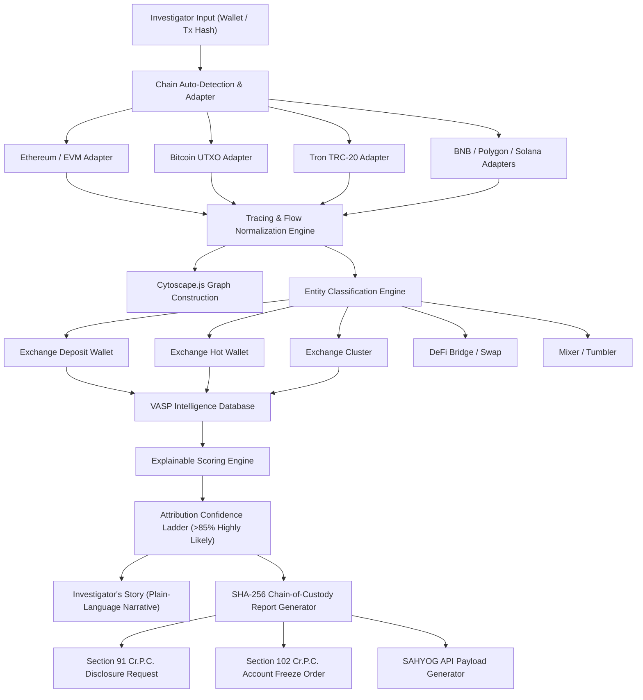

# 🛡️ CHAIN-INTEL

<p align="center">
  <a href="https://chain-intel-jade.vercel.app" target="_blank">
    
  </a>
  
  
  
  
  
  
  
</p>

> 🌐 **Live Web Application**: [https://chain-intel-jade.vercel.app](https://chain-intel-jade.vercel.app)

### **Automated Blockchain Intelligence & Wallet-to-VASP Attribution Platform**
> *"Every crypto trail ends somewhere. We find that end — automatically."*

---

## 📌 Executive Summary & Purpose

**CHAIN-INTEL** is an investigator-facing blockchain forensic intelligence workstation engineered for law enforcement agencies, cybercrime investigators, and national security analysts under **Smart India Hackathon 2026 (Problem Statement 26182)** for the **Ministry of Home Affairs (I4C / CIS Division)**.

When cybercrime or cryptocurrency fraud occurs, investigators are presented with an anonymous unhosted wallet address or transaction hash. Manually analyzing thousands of complex, multi-hop, cross-chain transfers is time-prohibitive. **CHAIN-INTEL** automates this process:

1. **Auto-Detects Blockchain Network** across Bitcoin, Ethereum, Tron, BNB Chain, Solana, and Polygon.
2. **Traces Transferred Funds Hop-by-Hop** through intermediate unhosted wallets, peel chains, bridges, and mixers.
3. **Classifies On-Chain Entities** into Exchange Deposit Wallets, Exchange Hot Wallets, Exchange Clusters, DeFi Bridges, and Privacy Mixers.
4. **Isolates Nearest Direct-Deposit Accepting VASP** with an explainable evidence score.
5. **Detects Suspicious Risk Typologies** (Ransomware, Darknet proceeds, Terrorism Financing indicators, Phishing fraud).
6. **Generates Forensically Stamped Reports** with deterministic SHA-256 chain-of-custody hashes.
7. **Routes Law Enforcement Orders** via Section 91 Cr.P.C. / BNSS Disclosure Requests and Section 102 Cr.P.C. / BNSS Account Freeze Orders.

---

## 🏛️ SIH 2026 Problem Statement Alignment

| Attribute | Details |
| :--- | :--- |
| **Problem Statement ID** | **26182** |
| **Organization** | **Ministry of Home Affairs (MHA) — Indian Cyber Crime Coordination Centre (I4C) / CIS Division** |
| **Theme** | **Blockchain & Cybersecurity** |
| **Category** | **Software** |
| **Core Objective** | Automated unhosted/unknown cryptocurrency wallet tracing, multi-chain graph analysis, nearest direct-deposit VASP attribution, risk typology detection, and law enforcement workflow routing. |

---

## ⚡ Key System Capabilities

### 1. 🎯 Nearest Direct-Deposit Accepting VASP Attribution Engine
Instead of merely indicating that funds eventually reached a distant exchange, **CHAIN-INTEL** explicitly ranks and isolates the **Nearest Direct-Deposit Accepting VASP**.
- **5 Attribution Tiers**: `CONFIRMED (95%+)`, `HIGHLY LIKELY (>85%)`, `PROBABLE (60-85%)`, `POSSIBLE (30-60%)`, `INSUFFICIENT DATA (<30%)`.
- **Explainable Scoring**: Transparent mathematical factor breakdown showing base score, hop distance penalties, direct deposit bonuses, and typology adjustments.

### 2. 🌐 Multi-Chain Forensic Architecture
Supported across 6 major blockchain networks with unified data normalization:
- **Bitcoin (BTC)**: UTXO re-consolidation & CoinJoin mixer analysis.
- **Ethereum (EVM)**: ERC-20 token tracking & smart contract interaction.
- **Tron (TRC-20)**: High-frequency USDT stablecoin outflow analysis.
- **BNB Chain**: BSC token transfers & instant exchange routing.
- **Solana (SOL)**: High-speed SPL token tracking.
- **Polygon**: Cross-chain L2 bridge transaction tracing.

### 3. 🕸️ Investigative Cytoscape Graph & Sequential Playback
- **Hierarchical Layout**: Cytoscape.js dagre-powered interactive transaction graph.
- **Entity Node Styling**: Distinct visual shapes for `EXCHANGE_DEPOSIT_WALLET`, `EXCHANGE_HOT_WALLET`, `EXCHANGE_CLUSTER`, `MIXER_TUMBLER`, `DEFI_BRIDGE`, `CROSS_CHAIN_SWAP_SERVICE`, and `UNHOSTED_WALLET`.
- **Hop Trace Playback**: Interactive step-by-step sequential playback player with speed controls (1x, 2x, 4x) and hop details drawer.

### 4. 🚨 High-Risk Intelligence Alerts & SIH Scenarios
Pre-loaded crime investigation scenarios ready for live judge demonstrations:
- **TB-001 (Investment Fraud)**: Ethereum -> 3-hop peel chain -> CoinDCX Direct Deposit (91% Highly Likely).
- **TB-002 (Healthcare Ransomware Extortion)**: Ethereum -> BlackCat ransomware outflow -> Binance Hot Wallet (87%).
- **TB-003 (Darknet Market Proceeds)**: Bitcoin -> Wasabi CoinJoin -> WazirX Deposit (78% Probable).
- **TB-004 (Terrorism-Financing Risk Indicator)**: Tron TRC-20 -> USDT Cluster -> Exchange Deposit (84%).
- **TB-005 (Cross-Chain DeFi Exploit)**: Ethereum -> Synapse Bridge -> Polygon -> FixedFloat Swap (64%).
- **TB-006 (Sanctioned Privacy Mixer Wash)**: Ethereum -> Tornado Cash 100 ETH contract (24% Insufficient Data).

### 5. ⚖️ Law Enforcement Workflow & Legal Notice Drafts
- **Section 91 Cr.P.C. / BNSS 2023**: Auto-generated formal Disclosure Request for KYC/AML and fiat transfer logs.
- **Section 102 Cr.P.C. / BNSS 2023**: Auto-generated Asset Restraint / Account Freeze Order to prevent crime proceeds diversion.
- **SAHYOG Integration Prototype**: Mock REST API endpoints (`POST /api/v1/sahyog/investigations`, `GET /api/v1/sahyog/traces/:id`, `POST /api/v1/sahyog/disclosure-notice`) with live payload simulator.

### 6. 🔒 Cryptographic SHA-256 Report Integrity
- Every generated investigation report receives a deterministic SHA-256 chain-of-custody stamp.
- Includes a standalone **Report Integrity Verification Tool** to check report authenticity against an append-only local audit ledger.

---

## 🏗️ System Architecture



---

## 💻 Tech Stack & Libraries

- **Frontend Framework**: React 18+ with Vite
- **Programming Language**: TypeScript
- **Styling & UI**: Custom CSS Tokens + Tailwind CSS v4.0 (Light-First Government Workstation Aesthetic)
- **Iconography**: Lucide React
- **Graph Visualization**: Cytoscape.js + Cytoscape-Dagre Hierarchical Layout Engine
- **Cryptographic Hashing**: Web Crypto API (Native SHA-256)
- **Document Output**: HTML5 Printable Report & PDF Preview Engine

---

## 🚀 Quick Start Guide

### Prerequisites
- Node.js `v18.0.0` or higher
- npm `v9.0.0` or higher

### Installation & Local Setup

1. **Clone the Repository**:
   ```bash
   git clone https://github.com/your-org/chain-intel.git
   cd chain-intel
   ```

2. **Install Dependencies**:
   ```bash
   npm install
   ```

3. **Launch Local Workstation Dev Server**:
   ```bash
   npm run dev
   ```

4. **Access Workstation**:
   Open your browser and navigate to `http://localhost:5173/`.

### Production Build & Compilation Check
```bash
npm run build
```

---

## 🎨 Design Philosophy & UX Principles

CHAIN-INTEL follows strict **Government Workstation Visual Guidelines**:
- **Light-First Palette**: Off-white background (`#F8FAFC`), crisp white panels (`#FFFFFF`), subtle slate borders (`#E2E8F0`), deep navy branding (`#0F172A`), and clean sans-serif typography (Inter).
- **Restrained Semantic Colors**: Green for verified/safe, Amber for caution/typology, Red for critical risk only.
- **NO Cyberpunk Tropes**: Strictly avoids neon colors, glowing cards, black hacker backgrounds, or Web3 crypto-bro aesthetics. Evaluated for maximum credibility before government technology judges.

---

## ⚠️ Data Provenance & Legal Disclaimer

> [!IMPORTANT]
> **CHAIN-INTEL** is strictly an **INVESTIGATIVE LEAD PLATFORM**.
> - All inferences explicitly demarcate **KNOWN FACT**, **INFERENCE**, and **UNCERTAIN / INSUFFICIENT DATA**.
> - It **NEVER** claims legal proof of criminality, confirmed human identities, or black-box ML magic.
> - Every attribution provides an investigative lead that requires independent verification via official VASP disclosure notices and legal process prior to formal judicial submission.

---

<p align="center">
  <b>Ministry of Home Affairs — I4C / CIS Division • Smart India Hackathon 2026</b><br>
  <i>Built with Precision for Law Enforcement & Cybersecurity Evaluators</i>
</p>
